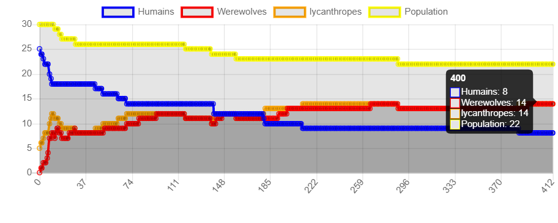
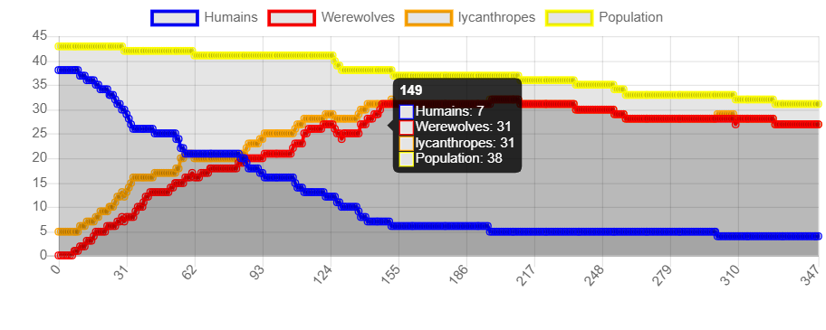
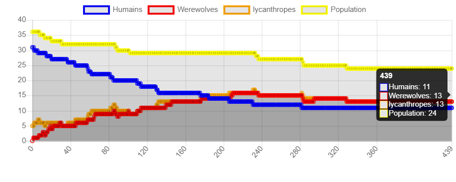
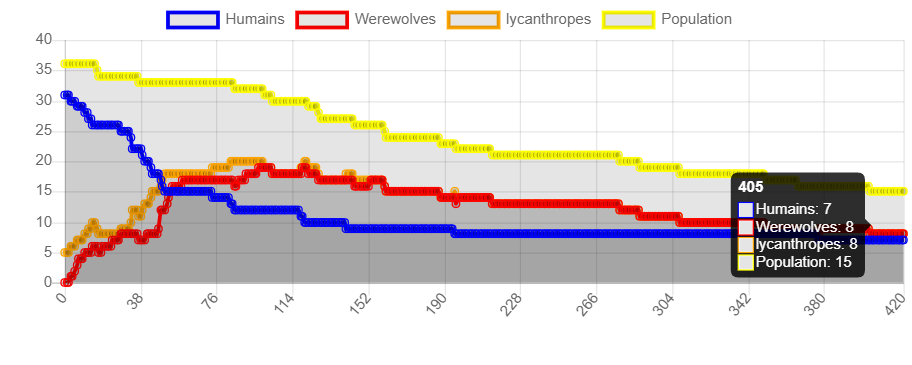

## Question 1
Pour que l'autre agent soit modifié, on agit en changeant l'état de variable booléenne qui indique l'infection de la personne en modifiant la méthode step d'agent.
Cela est compatible avec la définition vue en cours :
l'agent est :
Autonome : indépendant vis-à vis des autres éléments du système
Proactif : capable d'agir sans aucune intervention humaine
Adaptable: capable d'interagir avec son environnement et de prendre ses changement en compte
Sociable: capable d'interagir avec d’autres agents puisqu'un agent peut attaquer un autre

## Question 2
Après avoir exécuté la simulation une multitude de fois on peut conclure que le système converge vers la victoire des lycanthropes. 
En effet, la plupart des villageois deviendra des lycanthropes transformés aprés environ 342-424 steps en moyenne.

Quant à la présence de l'apothicaire, elle ralenti la convergence des villageois vers les lycanthropes.

L'augmentation du nombre des villageois favorise l'infectation en lycanthropes puisque cela améliore la probabilité d'être attaqué.

L'augmentation du nombre des chasseurs favorise la survie des villageois puisque cela diminue le nombre des lycanthropes transformés.

## Question 3
Les courbes obtenues montrent bien que le résultat est conforme aux conjectures, les lycanthropes sont avantageux est la population éventuellement converge vers les lycanthropes
Les courbes montrent que le nombre des villageois diminue rapidement, le nombre de population aussi diminue à cause des chasseurs, mais pas d'une manière remarquable.

## Question 4
Dans un premier cas, on fixe les paramètres initiaux comme suit: 

    Le nombre de villageois: 35
    Le nombre de lycanthropes: 5
    Le nombre de apothicaires: 1
    Le nombre de chasseurs: 2

On obtient cette courbe: 

On observe qu'en augmentant le nombre des villageois, le nombre de lycanthropes augmentent rapidement.

---
Maintenant, on change le nombre d'apothicaires initial: 

    Le nombre de villageois: 25
    Le nombre de lycanthropes: 5
    Le nombre de apothicaires: 4
    Le nombre de chasseurs: 2

On obtient cette courbe:   

On remarque que cela a un effet sur l'augmentation du nombre des lycanthropes. En effet, cette augmentation est lente.

----
En modifiant le nombre des chasseurs:

    Le nombre de villageois: 25
    Le nombre de lycanthropes: 5
    Le nombre de apothicaires: 1
    Le nombre de chasseurs: 5

On remarque que l'augmentation du nombre des chasseurs diminue le nombre de popolation vu qu'elle élimine les lycanthropes transformés.

Finalement, ces résultats correspondent aux hypothèses initiales. 

## Question 5

Selon moi, le résultat de la simulation est influencé par le ratio entre le nombre d'agents et l'espace au sein duquel les agents peuvent se déplacer, car c'est ce qui favorise les intéractions entre agents. 
En outre, il semble que les paramètres associés aux apothicaires et aux chasseurs ont aussi une influence plus importante sur le résultat de la simulation. En fait, ces deux types d'agents sont les seuls qui possèdent des pouvoirs permettant de remédier à l'infection des villageois sains.
Donc plus ils seront nombreux, plus cette lutte contre l'infection serait efficace. 

## Question 6

Dans cette partie, on suppose la présence d'un unique chasseur et on va étudier l'impact du nombre des apothicaires dans un village. 

A mon avis, je pense qu'avec un nombre d'apothicaires inférieur à 5, les lycanthropes seront encore dominants.
Comme on l'a déjà dit, les apothicaires ne peuvent agir que sur des lycanthropes non transformés ce qui est contraignant pour lutter contre l'infection.

## Question 7
Les résultats de cette expérience sont résumés dans ce tableau: 

|n_clerics|Humains|Population|Werewolves|lycanthropes|
|---|---|---|---|---|
|0|0|42|41|41|
|1|0|43|41|41|
|2|0|33|30|30|
|3|0|42|38|38|
|4|0|36|31|31|
|5|0|43|37|37|

On constate que plus le nombre d'apothicaires augmente, plus le nombre final de lycanthropes diminue. 
On remarque aussi, qu'à la fin la plupart de la population devient inféctée.

Comme déjà constaté, un nombre faible d'apothicaires n'aura pas une grande influence sur le résultat de la simulation: la dominance des lycanthropes persiste toujours malgré le fait que la population initiale des villageois sains est grande (est 50) par rapport au nombre initial des lycanthropes (qui est 5). 

## Question bonus

Variant toutes les variables sur toutes les valeurs permises par les slider est une expérience coûteuse en termes de temps donc comme solution on peut utiliser le multiprocessing. On utilise la classe BatchRunnerMP de mesa.batchrunner