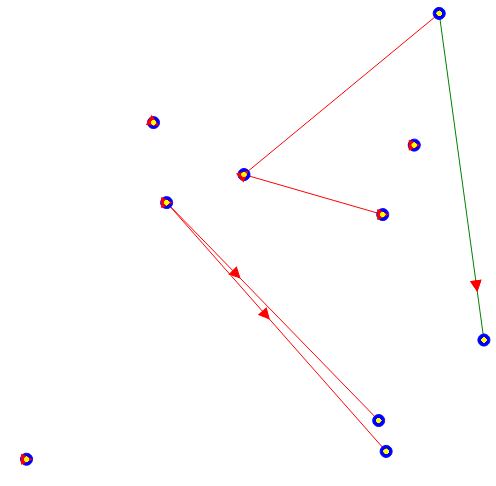

## Question1: 

Les caractéristiques de l'environnement sont :

Accessible : on a une information compléte et parfaite sur l'environnement. En effet, on a accés à toutes ses caractéristiques (ses planétes, ses vaisseaux)...

Déterministe : les instructions des agents sont bien définies et deterministes.

Non-episodique : on ne revient pas à l'état de départ à chaque fois.

Statique : les changements ici ne dépendent que des agents (PlanetManagers, Ships). S'il n'y pas variation provenant d'eux, l'environnement reste intact.

Continue : le déplacement dans l'espace est continu.

## Question2:

Les items n'intéragissent pas entre eux donc ils ne s'agissent pas d'agents. Ils sont plutôt sont objets manipulés par les agents.

## Question3:

Pour chaque expérience on fait varier le nombre de planètes et le nombre de vaisseaux pour constater l'évolution de chacun des nombre des biens présents et le nombre de biens livrés. 

---
Cas n°1 :

    nb_planets = 10, nb_ships = 3

On remarque que le nombre d'items (nombre de biens présents) est plus grand que le nombre de biens livrés. 
Cela est expliqué par la faible quantité de vaisseaux présents.

---
Cas n°2 :
 

    nb_planets = 10, nb_ships = 10

On remarque que lorsque le nombre de planètes et le nombre de vaisseaux sont égaux, l'évolution du nombre d'items et de bien livrés est presque identique. C'est à dire il y a suffisemment de vaisseaux pour assurer la transportation des livraisons.

---
Cas n°3 :

    nb_planets = 5 nb_ships = 20

On remarque que lorsque le nombre de vaisseaux est plus grand que le nombre de planètes, le nombre des objets livrés est plus grands.

## Question4:
Il s'agit d'une organisation coopérative. En effet, les agents cherchent à maximiser l'efficacité du réseau .

## Question5:
Le système est désormais dynamique puisque l'état de la route change sans l'intervention des agents.
Les autres caractéristiques restent les mêmes.

## Question6:

Les agents s'adaptent au changement de l'environnement  avec la modification de leurs vitesse selon l'état de la route. Cela correspond à la caractéristique fondamentale des agents qui est l'adaptabilité : capacité à interagir avec son environnement et de prendre ses changement en compte.

## Question7:

Cette simulation montre le changement de l'état de la route :

---
Cas 1 :

    nb_planets = 10, nb_ships = 3

---
Cas 2 :

    nb_planets = 10, nb_ships = 10

---
Cas 3 :

    nb_planets = 5, nb_ships = 20

En comparant avec la situation précédente, on remarque que l'écart entre les deux courbes a augmenté pour les 3 cas. Le système est moins efficace et converge plus lentement.

## Question8 (Bonus):

---
Cas 1 : 

    ROAD_BRANCHING_FACTOR = 0.1

---
Cas 2 : 

    ROAD_BRANCHING_FACTOR = 0.5

---
Cas 3 : 

    ROAD_BRANCHING_FACTOR = 0.9

D'aprés ces courbes, on constate que le nombre de bien livrés augmente en augmentant ROAD_BRANCHING_FACTOR.