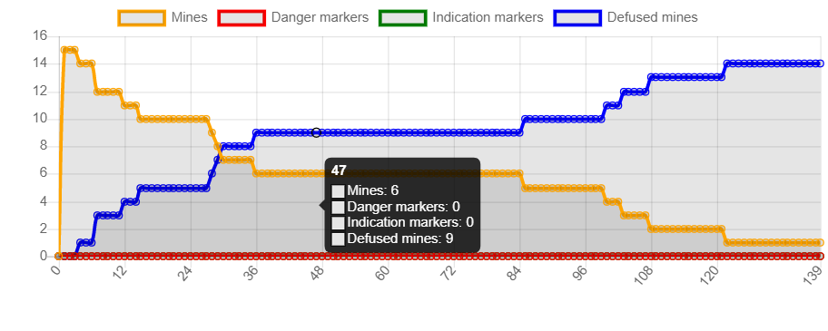
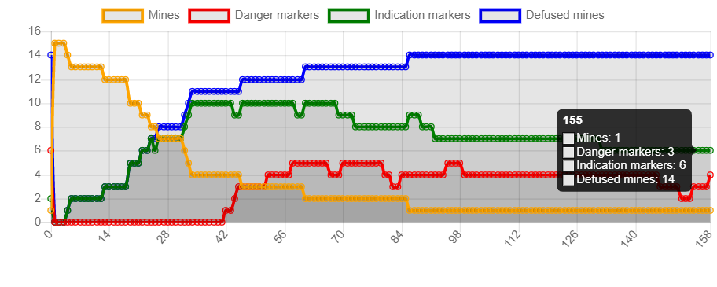
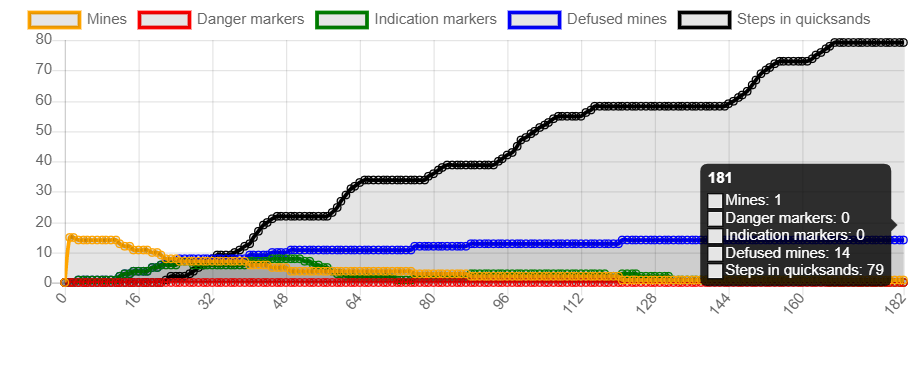
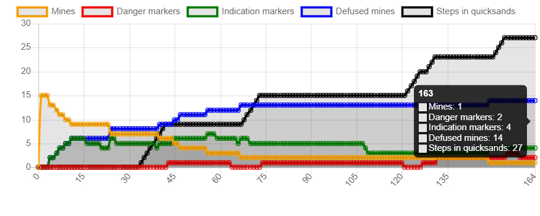

# Partie1 : Description basique du robot: 
## Question 1 : 

L'architecture qui paraît la plus à même de traiter ce problème est celle de Subsomption. En effet :

-Les comportements sont ordonnés par niveau d'importance.

-Il n'y a pas de communications directe entre agents.

-Les comportements sont simples.

## Question 2 : 
Pour que les robots ne rentrent pas en collision les uns avec les autres tout en permettant aux robots d’accomplir leur mission , je propose l'ordre de priorité suivant : 

0- Détruire une mine

1- Éviter un obstacle / les bords de l’environnement + Éviter un autre robot 

2- Se diriger vers une mine

3- Se déplacer

---
Le lancement de la simulation est effectué en fixant les variables à:

    number of robots = 7, number of obstacles = 5, number of quicksand = 5, robot speed = 15, number of mines = 15

 

On effectue cette simulation 10 fois. Pour chaque simulation, on regarde le nombre de steps comme le montre le tableau ci-dessous:

|Simulation|1|2|3|4|5|6|7|8|9|10|
|---|---|---|---|---|---|---|---|---|---|---|
|Nombre de steps|139|282|222|161|262|243|352|398|333|150|

Le temps moyen de désamorçage de toutes les mines est : 254.2

## Question 3 : 
Les principes des agents réactifs respéctés sont : 

- Modularité: à chaque situation on a un seul comportement.
- Pas de modèle: les actions sont basés sur les données issues des senseurs.

Cependant, dans ce modèle il n'y a pas de communications entre les agents (robots) via l'environnement. Les actions sont prises sans aucune communication.

# Partie2: Communication indirecte:

## Question 4 : 
En utilisant les balises, on introduit une communication entre les agents. Ainsi, le caractére Simplité de l'architecture réactive est vérifié ( Perception → action )

## Question 5 : 

Dans cette proposition, on a ajouté les comportements de collecte des balises, direction vers une balise et déplacement suivant l'indication de la balise collectée selon l'ordre de priorité suivant:

niveau 0 : Détruire une mine + Déposer une balise INDICATION

niveau 1 : Éviter un obstacle / les bords de l’environnement + Éviter un autre robot

niveau 2 : Se diriger vers une mine

niveau 3 : Collecter les balise + Se déplacer suivant l'indication de la balise collectée

niveau 4 : Se diriger vers une balise (DANGER/INDICATION)

niveau 5 : Se déplacer 

Justification : les nouveaux comportements ont été ajouté aprés le niveau de la detéction des mines car c'est plus interessant de se déplacer directement vers une mine que de suivre les indications, qui elles aussi va nous faire arriver à une mine.

## Question 6 : 
On effectue la simulation de la nouvelle proposition 10 fois. Pour chaque simulation, on regarde le nombre de steps comme le montre le tableau ci-dessous:

|Simulation|1|2|3|4|5|6|7|8|9|10|
|---|---|---|---|---|---|---|---|---|---|---|
|Nombre de steps|240|220|158|124|181|157|200|202|164|130|

 

Le temps moyen de désamorçage de toutes les mines est : 177.6

On constate une diminution remarquable du temps moyen de désamorçage. Cela est dû à l'effet des balises qui informent de manière indirecte les autres robots des mauvaises directions (sables mouvants ou mines déjà ramassées) afin de les éviter. Ce qui fait que les robots deviennent plus efficaces et détruisent les mines en peu de temps. 

## Question 7 : 

Dans la première figure où il n'y a pas des balises DANGER, on note que le temps passé est environ 80 tours sur un nombre de tours total égal à 182. Il s'agit d'un rapport de 0.4 à peu prés. 
 

Dans la deuxième figure, les balises DANGER sont activées, on note que le temps passé est environ 27 tours sur un nombre de tours total égal à 164. Il s'agit d'un rapport de 0.16 à peu prés. 
 

Donc on peut conclure qu'en ajoutant les balises DANGER, le temps moyen passé dans les sables mouvants diminue.

