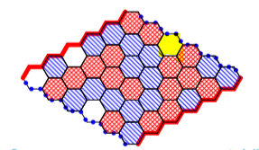
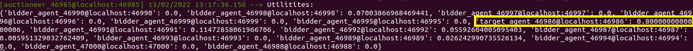
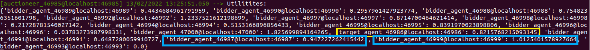

## Question 1 : 

Supposons que c'est à l'agent rouge de jouer, et que son but est de gagner, il choisit la case  indiqué en jaune dans la figure suivante : 

En effet, ce coup lui pourmettra de relier les deux côtés opposées (haute et basse) de sa couleur rouge alors que les autres cases possibles ne mèneront pas à la victoire.

## Question 2 : 

On pose J l'ensemble des arrêtes parcourues par le voyageur de commerce, ∆ti le temps de chaque arrête i et ci le coût de chaque arrête i. 

Pour un tel agent, on peut proposer les 2 fonctions d'utilités suivantes :

- $$  U1(J) = \sum \limits_{\underset{}{i=1}}^n -(c_i+∆t_i) $$
Ainsi, plus le temps et le coût sont élevés, moins l'agent aura d'utilité à prendre ces chemins. 

Néanmoins, dans ce cas on additionne simplement le temps et le coût sans savoir leur somme pondérée (lequel a le plus de poids pour l'agent) donc pour obtenir une utilité représentant mieux la réalité on ajoute deux coefficients liés au temps et au coût :
- $$  U2(J) = \sum \limits_{\underset{}{i=1}}^n -(\alpha c_i + \beta ∆t_i) $$

## Question 3 : 

* Pour l'expérience 1 : 

E[U(A1)] = 10.000 $

E[U(A2)] = 15.000 * 0.9 = 13.500 $

Si la rationalité des agents s'exprime comme étant l’espérance de l’utilité, alors les sujets de la première expérience ne sont pas rationnels vu que la majorité choisit la loterie A1 plutôt que la loterie A2 qui a l'espérance d'utilité la plus grande.

Ceci peut être expliqué par le fait que les sujets essaient d'éviter le risque de ne rien recevoir puisque le gain est garanti si ils choisissent la loterie A1.

* Pour l'expérience 2 : 

E[U(B1)] = 10.000 * 0.1 = 1.000 $

E[U(B2)] = 15.000 * 0.09 = 1.350 $
 
Les sujets de la deuxième expérience sont rationnels vu que la majorité choisissent la loterie B2 (qui a l'espérance d'utilité la plus grande) plutôt que la loterie B1. 

Ceci peut être expliqué par le fait que les sujets choisissent la loterie ayant un gain plus grand vu que la différence entre les probablité du gain est negligeable.

## Question 4 : 

Dans le cas où l'agent estime qu'il y a très peu de chance qu'un autre agent fasse une proposition au dessus de 80$ pour un bien qu'il estime à 100$, il est préferable de proposer une offre de 80$ afin de maximiser l'espérence de son utilité (il aura une utilité de 20$). Car s'il parie 100$ et fait l'enchère la plus importante, son utilité va être nulle.

## Question 5 :  

Soit un agent rationnel A qui estime l'objet à E et enchérit à Va.
on suppose que l'agent a intérêt à enchérir au-dessous de son estimation (càd Va<E).

Soit un autre agent B qui enchérit à Vb (On se limite à un seul autre agent puisque les agents sont indépendants), alors il existe 3 cas possibles :

- Vb < Va < E : A va gagner sauf que l'utilité est la même s'il enchérit Va puisqu'il paiera Vb
- Va < Vb < E : A va perdre contre B
- Va < E < Vb : A va perdre contre B

Donc on peut conclure que dans tous les cas, l'agent n'a pas d'interêt à enchérir au-dessous de son estimation.

## Question 6 :

Le résultat de la simulation est le suivant : 

On constate que l'agent target a la plus grande utilité avec sa stratégie malhonnête (encadré en jaune). Ceci est expliqué par la mécanique de l'enchère au premier prix.
De plus, on remarque que les agents honnêtes ont des utilités en moyenne nulles. Ceci est dû à leur stratégie.

## Question 7 : 

Le résultat de la simulation est le suivant : 

Dans ce cas, on constate que l'agent Target n'a plus la grande utilité (encadré en jaune). Par contre, les agents honnêtes arrive à avoir de meilleurs résultats (encadrés en bleu). D'aprés cette simulation, on peut confirmer les résultats théoriques de l'enchére de Vickrey (la stratégie optimale est de parier au juste prix).

## Question 8 - BONUS : 

Supposons que les bidders se mettent d’accord pour tous faire un pari au dessous du meilleur prix, tout en conservant l’ordre des offres afin de payer moins cher.
- Dans le cas des enchères au premier prix, on suppose que tous les agents font une offre à la moitié de l'utilité calculée. Alors, l'agent qui gagne aura une utilité égale à v/2 au lieu de 0. Il est donc clair qu'il a augmenté son utilité. Si l’agent ayant la seconde meilleure offre trahisse le gagnant légitime et fasse une offre à sa véritable utilité, il y aura deux cas possibles : soit il parit avec une valeur inférieure à v/2 et donc rien ne va changer, ou bien il parit avec une valeur supérieure à v/2 et remporte l'enchère avec une utilité nulle. Et l'utilité du gagnant légitime devient nulle car il ne gagne pas. Dans ce type d'enchère, un agent préfère remporter l'enchère avec une utilité nulle que de ne pas l'emporter. D'où les agents ont intérêt à trahir et donc la coalition de bidders n'est pas stable.

- Dans le cas des enchères de Vickrey, on suppose que celui qui fait la meilleure offre peut conserver sa meilleure offre pendant que les autres divisent leur offre par deux. Dans ce cas, les agents n'ont pas d'intérêt à trahir et donc la coalition de bidders est stable.

